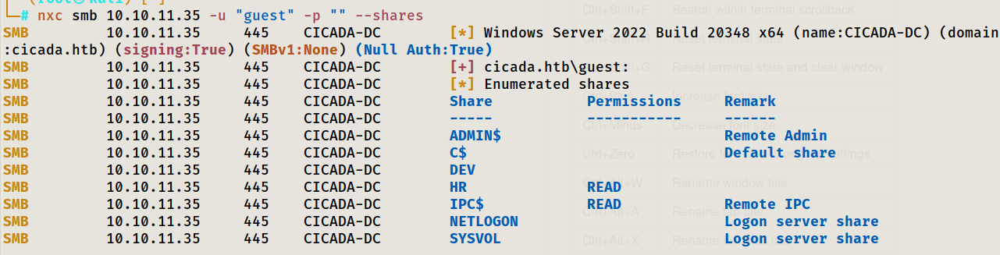
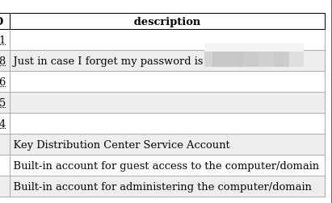
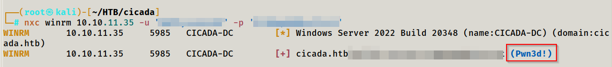

# HTB Cicada (Retired) Full Walkthrough


## About Cicada

Cicada is a Windows Active Directory machine that highlights how **overly-permissive SMB access** and **poor credential hygiene** can quickly turn into full compromise. The initial foothold is enabled by **SMB Guest access**, which allows share browsing and user enumeration. From there, multiple credentials are recovered through common enterprise mistakes: **default onboarding passwords**, **secrets stored in AD attributes (e.g., description fields)**, and **credentials left in file shares**.

With a WinRM session established, privilege escalation is achieved through **SeBackupPrivilege**, enabling extraction of high-value credential material and escalation to **Administrator**.

## Network Scans

As usual we start with an Nmap scan to see which ports are open. 

```bash
nmap -p- -T5 10.10.11.35
```
What the flags mean:

- -p-: Scan all 65,535 TCP ports (not just the default top 1,000)

- -T5: Fastest timing template

|  |
| :--: |
| *Nmap Open Ports* |

Once I had a list of open ports, I ran a targeted follow-up scan against them to identify service versions, run default scripts, and gather OS/network fingerprinting details:

```bash
nmap -A -T4 -p53,88,135,139,445,464,593,636,3268,3269,5985,63705 10.10.11.35
```

What the flags mean:

- -A: Enables OS detection, version detection, script scanning, and traceroute

- -T4: Faster timing template (reasonable for lab environments)

|  |
| :--: |
| *Nmap Full Scan* |

What some of these ports mean:

- **53: DNS(Domain Name Resolution).** Resolves host names ↔ IPs. On a domain controller, DNS is critical for AD (clients locate DCs/services via DNS SRV records).

- **88: Kerberos.** Default authentication protocol for Active Directory. Presence of 88 is a strong we are dealing with a domain environment.

- **135: MSRPC.** Many Windows management functions start here before switching to a dynamic high port.

- **139: NetBios.** LEgacy SMB over NetBIOS. Still commonly exposed for compatibility. Often found paired with 445

- **445: SMB.** Windows file sharing + many AD-related remote operations. Used for share access, domain/user enumeration, etc

- **636: LDAPS(LDAP over TLS).** Used to query Active Directory securely (users, groups, policies, descriptions, etc)

- **3268: LDAP.** LDAP queries against the Global Catalog (forest-wide index). Useful for searching users/groups across the domain/forest.

- **5985: WinRM.** Windows Remote Management. If credentials allow, this is a common path to remote command execution (e.g., Evil-WinRM).

This scan strongly suggests the target is a **Windows Active Directory Domain Controller**. The presence of DNS (53), Kerberos (88), and multiple LDAP/Global Catalog services (636/3268/3269) indicates it’s serving core AD roles.

## Enumerating Services

Since SMB is exposed, we can first check whether the host allows **anonymous** or **Guest** access. I tested SMB authentication using my favourite AD enumeration tool: **NetExec**.

```bash
nxc smb 10.10.11.35 -u '' -p ''
```

| 
| :--: |
| *SMB Anonymous Access* |

Anonymous authentication appears possible, but it doesn’t grant access to any useful resources. Guest access, however, was a different story:

```bash
nxc smb 10.10.11.35 -u 'guest' -p ''
```

| 
| :--: |
| SMB Guest Access |

With Guest access confirmed, we can enumerate shares and permissions:

```bash
nxc smb 10.10.11.35 -u 'guest' -p '' --shares
```

| 
| :--: |
| *SMB Guest Shares Enum* |

Guest had **read access** to the `HR` share. While enumerating the share contents, I found and downloaded a file that contained the **default password issued to new hires**.

|  |
| :--: |
| *Default Password Found* |

Now that I had a password, I needed a list of valid domain users to test it against. Since Guest access was available, we can use RID brute enumeration (RID cycling) to discover usernames. This works by iterating Relative Identifiers (RIDs) and asking the Domain Controller to resolve the corresponding SID → account name mappings, which can reveal valid users and groups without guessing names.

```bash
nxc smb 10.10.11.35 -u 'guest' -p '' --rid-brute
```

|  |
| :--: |
| *RID Brute User* |

I compiled the discovered usernames into `users.txt` and performed a password spray using the default password.

```bash
nxc smb 10.10.11.35 -u users.txt -p [PASSWORD]
```

|  |
| :--: |
| *Password Spraying Default Password* |

Looks like someone didn’t follow HR’s  instruction.

## Lateral Movement

After obtaining valid domain credentials, I re-enumerated SMB shares and tested common services again. This didn’t immediately reveal anything different, so I pivoted to **LDAP enumeration** which was now possible with authenticated creds.

I used `ldapdomaindump` to collect domain objects and attributes for offline review. While inspecting the output, I discovered a **password stored in a user’s description field**.

```bash
ldapdomaindump -u 'cicada.htb\michael.wrightson' -p 'REDACTED' 10.10.11.35 -o ldap_dump
```

|  |
| :--: |
| *Password Leak in Description* |

With the new credentials, we can repeat share enumeration. This time I gained access to a previously inaccessible share: `DEV`. Inside `DEV`, I found a PowerShell backup script that contained another set of valid domain credentials.

|  |
| :--: |
| *`DEV` Share* |

| 
| :--: |
| *Password Leak in Backup Script* |

Finally, I validated the new credentials against WinRM and confirmed remote shell access

|  |
| :--: |
| *WinRM Access* |

## Privilege Escalation

One of the first things we should do when getting a shell is list privileges with the account we have access to. One of the first things I noticed was the `SeBackupPrivilege`. 

|  |
| :--: |
| *Dangerous Privileges* |

This means that a user with this privilege can create a full backup of the entire system including the `NTDS.dit` file and the `HKLM\SYSTEM` hive. Then with the full backup, we can extract the hashes and attempt to crack them or perform a Pass-the-Hash attack.

Since sensitive hive files are typically locked by the OS on the live filesystem, I used DiskShadow (a Microsoft VSS utility) to create a Volume Shadow Copy snapshot of the C: volume and expose it as a new drive letter. This made it possible to copy locked files from the snapshot rather than the live disk.

We can prepare a DiskShadow script(backup_script.txt) to perform a full backup of the `C:` drive and exposes it as a network drive with the drive letter `E:`.

```
set verbose on
set metadata C:\Windows\Temp\meta.cab
set context clientaccessible
set context persistent
begin backup
add volume C: alias cdrive
create
expose %cdrive% E:
end backup
```
DiskShadow initially mis-parsed the script. This was caused by script formatting. Linux style line endings can break DiskShadow's parser. 

|  |
| :--: |
| *Backup Script Failing* |

After converting the file to Windows-friendly line endings, DiskShadow executed successfully:

|  |
| :--: |
| *Fixing Parsing Issue* |

|  |
| :--: |
| *Backup Success* |

With the snapshot exposed as `E:`, we can copy the `NTDS.dit` from the shadow copy to a writable location on disk using `robocopy`

|  |
| :--: |
| *Shows copy of ntds.dit file* |

Next, we need to get the system registry hive that contains the keys needed to decrypt the `NTDS` file with the `reg save` command. 

|  | 
| :--: |
| *Shows copy of system registry hive* |

Then we can download the files locally to our machine to extract the hashes using Impacket's`secretsdump.py`.

|  |
| :--: |
| *Dumped Hashes* |

With the Administrator NTLM hash, we can authenticat via **Pass-the-Hash** to obtain an Administrator WinRM session and retrieve the root flag:

|  |
| :--: |
| *Root Flag* |

