# HTB Sauna (Retired) Full Walkthrough


## About Sauna

Sauna is a retired **Easy** Windows machine focused on **Active Directory (AD) enumeration and exploitation**. The initial foothold comes from employee full names being exposed on the website’s _About Us_ page, which can be converted into likely domain usernames and validated via Kerberos user enumeration. From there, the box demonstrates **AS-REP Roasting** against an account configured without Kerberos pre-authentication, producing an offline-crackable response that can be cracked to recover valid credentials and gain a **WinRM** foothold.

Post-compromise enumeration then reveals poor credential hygiene: **AutoLogon** is configured, and (as Microsoft warns) AutoLogon can store passwords in the registry in plaintext, making credential recovery trivial once you have local access. Finally, BloodHound helps map privilege relationships and highlights a path to full domain compromise. A service account has AD replication permissions that enable **DCSync**, allowing extraction of Domain Admin credential material and escalation to complete domain control.

## Network Scans

I started by conducting a network scan with Nmap to identify open ports, active services, target operating system and general network details. The command I used was:

```bash
    nmap -p- -A -T4 10.10.10.175
```

What the flags mean:

- -p-: Scan all 65,535 TCP ports (not just the default top 1,000)..

- -A: This is equivalent to doing all 3 of the following flags

  - Service Detection (-sV): Identifies running services and versions

  - OS Detection (-O): Attempts to determine the target's operating system

  - Script Scanning (-sC): Runs Nmap's default scripts for more insight

- -T4: Faster timing template (a practical balance for lab environments; higher -T generally increases aggressiveness starting from 0 up to 5).

|  |
| :-----------------------------------------------------: |
|                   _Nmap Scan Results_                   |

What some of these ports mean:

- **Port 53**: Domain Name System(DNS): Translates human readable domain names int IP addresses and vice versa.

- **Port 80**: Used by the Hypertext Transfer Protocol (HTTP) service. It is a set of rules (protocol) that dictates how web browsers (clients) request and receive information from web servers

- **Port 88**: Kerberos: Ticket based authentication system. This indicates this host is likely a Windows Domain Controller

- **Port 135**: Remote Procedure Call(RPC): is a way for one computer/program to run a function on another computer over the network as if it were a normal local function call.

- **Port 139**: Network Basic Input Output System (NetBIOS).

- **Port 389**: Lightweight Directory Access Protocol(LDAP): is basically a network phone book that computers and apps can look up and query things.

- **Port 445** (SMB): Modern SMB runs directly over TCP 445

- **Port 5985**: Windows Remote Management(WinRM): It is Windows’ built-in way to run commands and manage a Windows machine remotely.

## Enumerating Services

Since SMB and RPC are present, we can try to anonymously authenticate. If null/guest works, we may enumerate shares, users, groups, and policies. On modern Windows this often fails, but it’s quick to check.

| 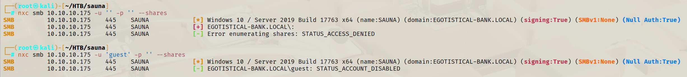 |
| :-------------------------------------------------------------: |
|         _Failed Anonymous and Guest SMB Authentication_         |

|  |
| :----------------------------------------------------------------: |
|               _Failed Anonymous RPC Authentication_                |

We are denied access to both of these services. We can try to enumerate LDAP using Nmap scripts to see if we can find anything. Command used was:

```bash
nmap -n -sV --script "ldap* and not brute" -p 389 10.10.10.175
```

This revealed a potential username. We added this username to our user.txt file containing names of potential domain users.

|  |
| :-------------------------------------------------------: |
|                     _Username found_                      |

I then used a tool called Namebuster created by benbusby that helps me generate a list of possible username permutations based on a list of names.

| 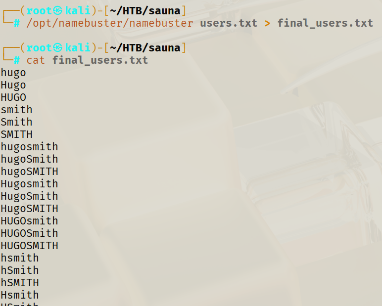 |
| :---------------------------------------------: |
|               _Namebuster usage_                |

After generating username permutations, I validated which usernames actually exist in the domain using Kerbrute’s `userenum`. This step reduces noise and produces a clean list of confirmed users for later attacks.

```bash
kerbrute userenum -d egotistical-bank.local --dc 10.10.10.175 final_users.txt
```

| 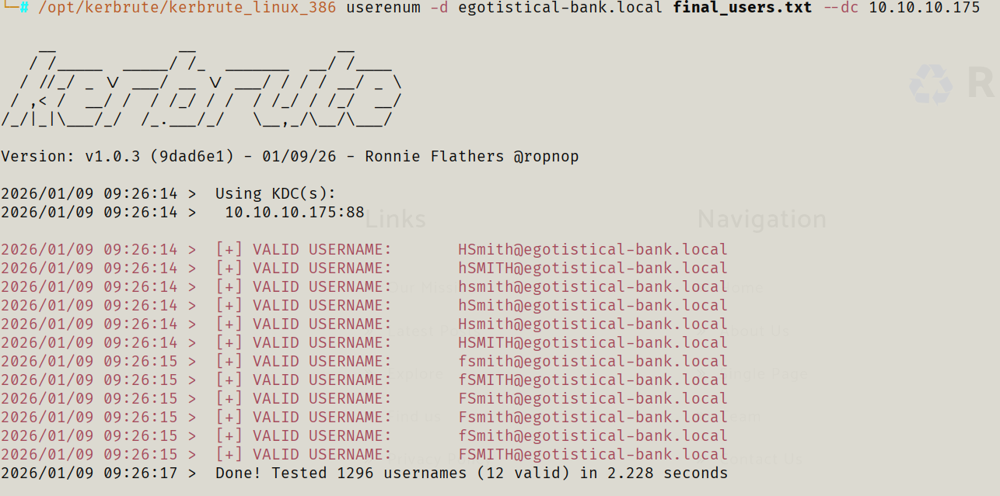 |
| :-----------------------------------------: |
|     _Kerbrute confirms valid usernames_     |

We should now check whether we can perform AS-REP Roasting using these potential usernames. AS-REP Roasting targets user accounts with Kerberos pre-authentication disabled. The attacker requests an authentication ticket (TGT) for such users, receiving an encrypted response that can be brute-forced offline to recover the user’s plaintext password. This attack does not require domain credentials. We can use Impacket’s GetNPUUsers module to perform this attack.

```bash
impacket-GetNPUsers egotistical-bank.local/ -dc-ip 10.10.10.175 -usersfile final_users.txt -no-pass
```

Unfortunately this user was not vulnerable to AS-REP Roasting.

|  |
| :------------------------------------------------------------------: |
|       _Attempting AS-REP Roasting with initial username list_        |

At this point, since port 80 was open, I moved to the website to look for higher-signal identity information (employee names, emails, login portals). I found an About Us page listing team members’ full names, which I added to my names list and re-ran Namebuster to generate a stronger set of likely domain usernames.

|        |
| :---------------------------------------------: | --- |
| _Names of employees found in the About Us page_ |     |

## Initial Access

Now that we have a bigger list of usernames, we can attempt AS-REP Roasting attack again.

|  |
| :----------------------------------------------------: |
|                _Hash found for a user_                 |

This time, we were able to retrieved an AS-REP hash for a user. We can use Hashcat to crack the password using module 18200.

```Powershell
hashcat.exe -m 18200 .\Hashes\hash.sauna.htb.txt .\Wordlist\rockyou.txt
```

| 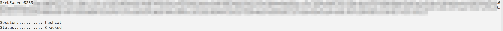 |
| :----------------------------------------------: |
|                _Cracked password_                |

Now we have a valid username and password. We can validate where the credentials authenticate (WinRM/SMB/etc.). My preferred tool to do this is Netexec which is considered an upgraded version of CrackMapExec(CME). Netexec is a enumeration and exploitation tool for Windows Active Directory. It can help with protocols like SMB, WinRM, RPC, LDAP and others.

| 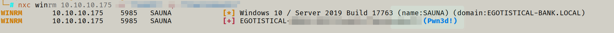 |
| :-----------------------------------------------------: |
|                _We have access to WinRM_                |

We can use a tool called Evil-WinRM to get remote access to the system.

|  |
| :-----------------------------------------------: |
|            _Successful shell as user_             |

We enumerate explore the drive a bit more and find the user.txt flag.

| 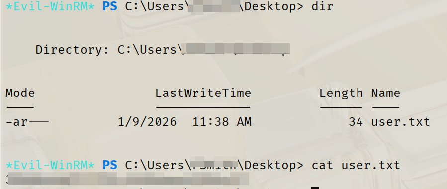 |
| :----------------------------------: |
|            Read user.txt             |

## Lateral Movement

We should try running a tool called WinPEAS. WinPEAS is a Windows privilege escalation auditing script that automates the enumeration of system configurations, installed software, and potential vulnerabilities to help identify paths for privilege escalation. We can use Evil-WinRM "upload" command to transfer files from our machine to the victim machine.

|  |
| :--------------------------------------------------: |
|                  _Running WinPEAS_                   |

> During this stage I ran into a road block. This was due to me not carefully enumerating the Windows architecture and accidentally running the x86 version of WinPEAS rather than the x64 😂

WinPEAS revealed **AutoLogon** configuration. AutoLogon is a convenience feature that can automatically sign a user in at startup, but Microsoft notes this can be a security risk because the password is stored in the registry in **plain text**.

| 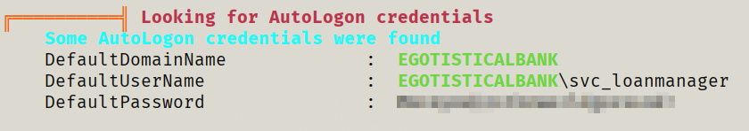 |
| :------------------------------------------------: |
|    _Found AutoLogon Creds stored in plaintext_     |

We also found a user with a similar username.

| 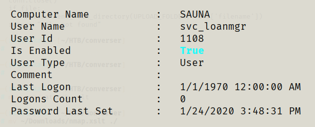 |
| :-------------------------------------------------: |
|          _Similar username to creds found_          |

We try to authenticate to various services with the username and password found in the AutoLogon but failed.

| 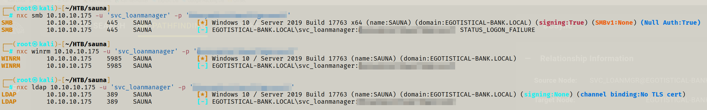 |
| :-----------------------------------------------------------: |
|         _Failed authentication using svc_loanmanager_         |

However, if we try "svc_loanmgr" we get authentication to WinRM!

| 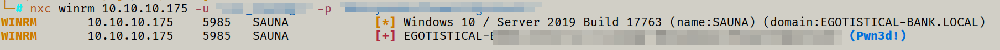 |
| :----------------------------------------------------------: |
|        _Successful Authentication using svc_loanmgr_         |

## Privilege Escalation

Once we authenticated to svc_loanmgr via Evil-WinRM, we did not have any additional access. Next we can try to use a different tool called BloodHound. BloodHound uses graph theory to visualise AD relationships and helps highlight privilege paths that are easy to miss when you’re enumerating manually.

First we run the BloodHound collection using credentials we have found before.

|  |
| :------------------------------------------------------------: |
|               _Collecting data with BloodHound_                |

Once the data is loaded, BloodHound shows that `svc_loanmgr` has the **GetChanges** and **GetChangesAll** replication-related privileges. These rights are important because they can be abused to perform a **DCSync** attack.

**DCSync** abuses the same replication mechanism domain controllers use to stay in sync. An attacker with the right replication permissions can impersonate a DC and request credential material from a real DC via the **Directory Replication Service Remote Protocol (MS-DRSR / DRSUAPI)** without needing to run code directly on the domain controller.

|  |
| :--------------------------------------------------: |
|      _Path to Domain Admin from "svc_loanmgr"_       |

|  |
| :--------------------------------------------------------: |
|        _Dangerous Privileges held by "svc_loanmgr"_        |

We can use Impacket's secretdump.py to perform the DCSync attack.

| 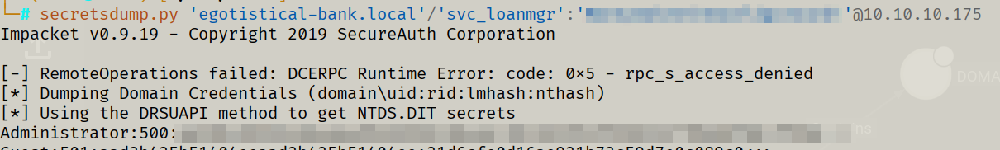 |
| :--------------------------------------------: |
|       _Retrieve hash of Administrator!_        |

Once we get hold of the hash of the Administrator, we do not need to take it offline to crack it. With NTLM-based authentication, it’s often possible to authenticate using the **hash itself** (Pass-the-Hash)

|  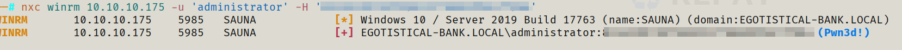   |
| :----------------------------------------------: |
| _Able to Authenticate as Administrator on WinRM_ |


